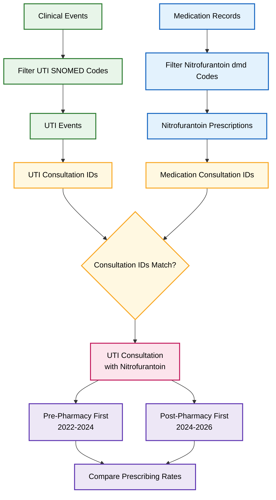
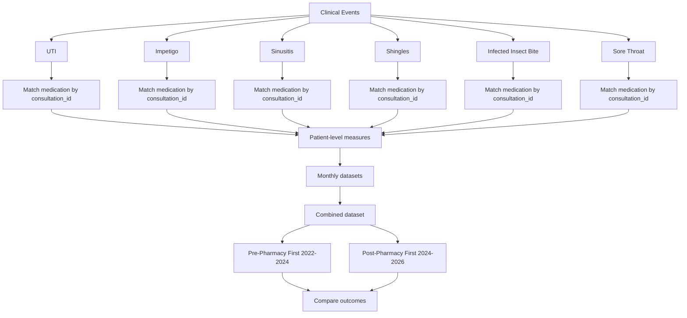

# WP2-PharmacyFirst-Protocol4-antimicrobial-prescribing

[View on OpenSAFELY](https://jobs.opensafely.org/repo/https%253A%252F%252Fgithub.com%252Fopensafely%252FWP2-PharmacyFirst-Protocol4-antimicrobial-prescribing)

Details of the purpose and any published outputs from this project can be found at the link above.

The contents of this repository MUST NOT be considered an accurate or valid representation of the study or its purpose. 
This repository may reflect an incomplete or incorrect analysis with no further ongoing work.
The content has ONLY been made public to support the OpenSAFELY [open science and transparency principles](https://www.opensafely.org/about/#contributing-to-best-practice-around-open-science) and to support the sharing of re-usable code for other subsequent users.
No clinical, policy or safety conclusions must be drawn from the contents of this repository.

# Project oververview 
>Last updates : June 9, 2026.

>This repository contains the analytical code and study materials for Protocol 4 (P4) of Work Package 2 (WP2) within the Pharmacy First Evaluation programme.

The objective of this study is to evaluate changes in antimicrobial prescribing following the introduction of the NHS Pharmacy First service in England. Specifically, the study aims to:

                             1.Quantify changes in antimicrobial prescribing volume following Pharmacy First implementation.
                             2.Assess condition-specific prescribing patterns across the seven Pharmacy First conditions.
                             3.Evaluate changes in first-line antibiotic prescribing by antimicrobial class.
                             4.Examine changes in the proportion of consultations resulting in antimicrobial prescribing.
                             5.Assess changes in antibiotic prescription duration.

The study uses routinely collected NHS primary care electronic health records available through the OpenSAFELY-TPP platform and applies interrupted time series methods to evaluate prescribing trends before and after Pharmacy First implementation.

**Study Design**

          Quasi-experimental interrupted time series design.
          Observation period: February 2022 to February 2026.
          Unit of analysis: General practice (GP) monthly prescribing data.
          Data source: OpenSAFELY-TPP linked NHS datasets.

The repository will be organised around several core components:

         1.patient-level dataset generation
         2.practice-level aggregation and summary 
         3.validation workflows, including  pregnancy variable checking and validation several patient-level measures snomed code occurrancence counting

>## Core patient-level dataset definitions

- [dataset_definition_patients_Arnaud](analysis/dataset_definition_patients_Arnaud.py): Main patient-level dataset definition used to generate monthly datasets for downstream analyses. Monthly datasets are generated separately for each study month.
- [dataset_definition_patients_measures_Arnaud](analysis/dataset_definition_patients_measures_Arnaud.py): Separate patient-level dataset definition used specifically for generating measures and validation outputs. This dataset is primarily used for measure generation, exploratory summaries and validation, and practice-level aggregation.

>## Codelists
In codelists file (**codelists/**), we have a combination of codelists for P2 and P4. The codelists for P4 include specific antimicrobial treatment (Amoxicillin), PF conditions which are indexed as **"name of conditions " codes for pharmacy first**, and controls for which are named **"name of the condition " as control for " name of the PF condition"**. All these codelists were added using  : **opensafely codelists add link from OpenCodelists** in the VSC's terminal.
# About the OpenSAFELY framework

The OpenSAFELY framework is a Trusted Research Environment (TRE) for electronic
health records research in the NHS, with a focus on public accountability and
research quality.

Read more at [OpenSAFELY.org](https://opensafely.org).

# Licences
As standard, research projects have a MIT license. 
